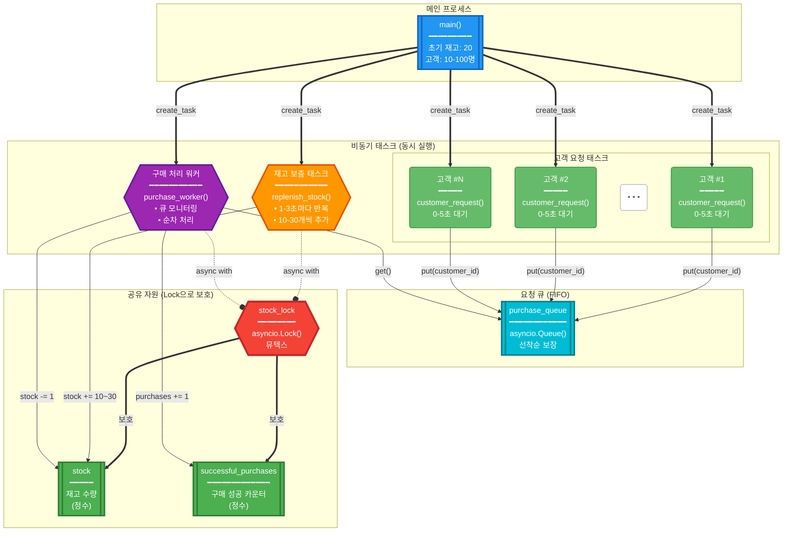
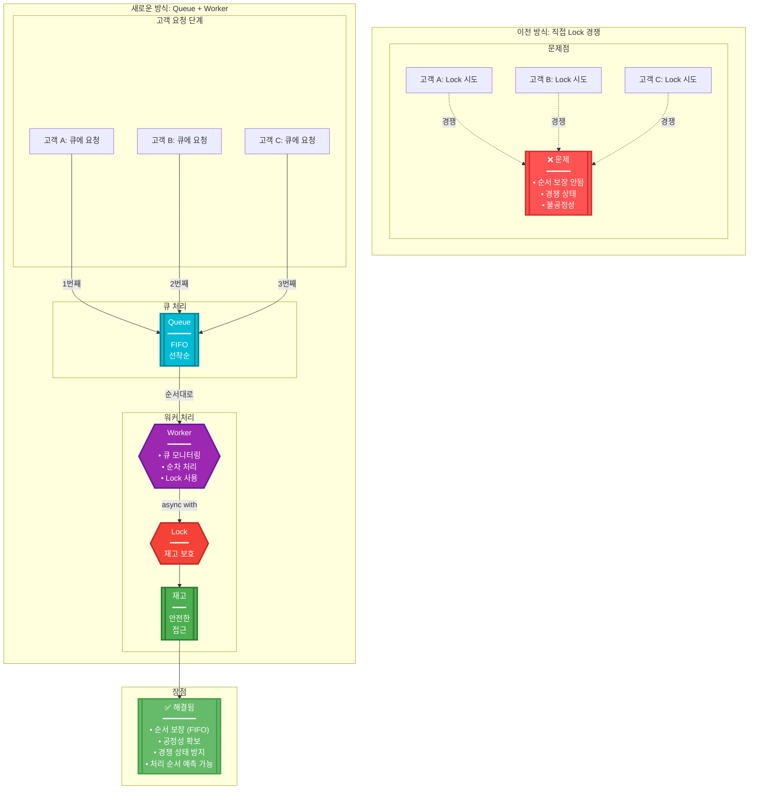

# 🛒 비동기 쇼핑몰 재고 관리 시뮬레이션

Python asyncio를 사용하여 동시성 제어(뮤텍스)와 Queue를 이용한 순서 보장을 실험하는 쇼핑몰 재고 관리 시뮬레이션입니다.

## 📋 프로젝트 개요

이 프로젝트는 다음과 같은 시나리오를 시뮬레이션합니다:

- 일정 시간마다 상품 재고가 보충되는 쇼핑몰
- 10~100명의 사용자가 선착순으로 상품을 구매
- `asyncio.Queue`를 사용한 순서 보장 및 공정성 확보
- `asyncio.Lock`을 사용한 경쟁 상태(Race Condition) 방지

## 🏗️ 시스템 아키텍처

### 전체 구조 (Queue 기반 워커 패턴)



### 동시성 제어 메커니즘 (Queue + Lock 패턴)



## 🔧 주요 컴포넌트

### 1. **전역 변수**

- `stock`: 상품 재고를 나타내는 전역 변수
- `stock_lock`: `asyncio.Lock` 객체 (뮤텍스 역할)
- `successful_purchases`: 구매 성공한 고객 수
- `purchase_queue`: `asyncio.Queue` 객체 (FIFO 순서 보장)

### 2. **재고 보충 함수 (`replenish_stock`)**

```python
async def replenish_stock():
    """일정 시간마다 재고를 보충하는 작업"""
    while True:
        await asyncio.sleep(random.uniform(1, 3))  # 1-3초 대기
        async with stock_lock:  # Lock 획득
            stock += random.randint(10, 30)  # 10-30개 추가
```

### 3. **구매 처리 워커 (`purchase_worker`)**

```python
async def purchase_worker():
    """큐에서 구매 요청을 순서대로 처리하는 워커"""
    while True:
        customer_id = await purchase_queue.get()  # 큐에서 요청 가져오기
        if customer_id is None:
            break  # 종료 신호
        
        async with stock_lock:  # Lock 획득
            if stock > 0:
                stock -= 1  # 구매 성공
            # 처리 완료
        purchase_queue.task_done()
```

### 4. **고객 요청 함수 (`customer_request`)**

```python
async def customer_request(customer_id: int):
    """고객이 구매를 요청하는 작업"""
    await asyncio.sleep(random.uniform(0, 5))  # 랜덤 대기
    await purchase_queue.put(customer_id)  # 큐에 요청 추가
```

## 📊 동작 원리

1. **초기화**: 재고 20개로 시작
2. **비동기 태스크 생성**:
   - 1개의 재고 보충 태스크 (무한 루프)
   - 1개의 구매 처리 워커 태스크
   - N개의 고객 요청 태스크 (10~100개)
3. **Queue를 통한 순서 보장**:
   - 고객들이 랜덤한 시간에 도착하여 큐에 요청
   - 워커가 큐에서 FIFO 순서로 요청을 처리
4. **Lock을 통한 동기화**: 
   - 재고에 접근하려는 워커와 재고 보충 태스크는 `stock_lock`을 획득해야 함
   - 한 번에 하나의 태스크만 재고에 접근 가능
5. **깔끔한 종료**: 
   - 모든 고객 요청 완료 후 워커에게 종료 신호 전송
   - 워커 완전 종료까지 대기하여 정확한 통계 보장

## 🚀 실행 방법

```bash
python3 shopping_mall_simulation.py
```

### 요구사항
- Python 3.11 이상
- 추가 패키지 설치 불필요 (표준 라이브러리만 사용)

## 📈 실행 결과 예시

```text
🛒 쇼핑몰 시뮬레이션 시작!
📌 Queue를 사용한 순서 보장 버전

초기 재고: 20개
총 고객 수: 45명

🔔 고객 #12 구매 요청 (큐에 추가)
👤 고객 #12 구매 처리 중...
✅ 고객 #12 구매 성공! (남은 재고: 19개)
🔔 고객 #7 구매 요청 (큐에 추가)
👤 고객 #7 구매 처리 중...
✅ 고객 #7 구매 성공! (남은 재고: 18개)
...
📦 재고 보충: +24개 (현재 재고: 24개)
...
👤 고객 #38 구매 처리 중...
❌ 고객 #38 구매 실패 - 재고 없음

📊 시뮬레이션 결과:
총 고객 수: 45명
구매 성공: 32명
구매 실패: 13명
최종 재고: 5개
```

## 💡 핵심 개념

### asyncio.Queue (FIFO 큐)

- **선착순 보장**: 먼저 요청한 고객이 먼저 처리됨
- **공정성**: 모든 고객이 동등한 기회를 가짐
- **순서 예측 가능**: 처리 순서가 명확함

### asyncio.Lock (뮤텍스)

- **상호 배제(Mutual Exclusion)**: 공유 자원에 대한 동시 접근 방지
- **경쟁 상태 방지**: 데이터 일관성 보장
- **원자적 연산**: 재고 확인과 차감이 하나의 단위로 실행

### Worker 패턴

- **중앙 집중 처리**: 하나의 워커가 모든 요청을 순차 처리
- **백그라운드 실행**: 독립적으로 실행되며 큐를 지속 모니터링
- **깔끔한 종료**: 종료 신호를 통한 안전한 리소스 정리

## 🔍 추가 실험 아이디어

1. **멀티 워커**: 여러 워커로 처리 속도 향상
2. **우선순위 큐**: VIP 고객 우선 처리
3. **타임아웃**: 구매 처리 시간 제한
4. **큐 크기 제한**: 대기 가능한 최대 고객 수 설정
5. **통계 분석**: 평균 대기 시간, 처리량 등 분석 