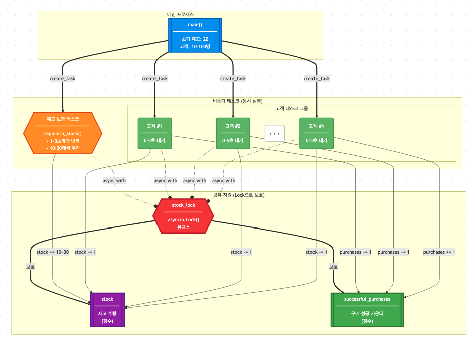

# 🛒 비동기 쇼핑몰 재고 관리 시뮬레이션

Python asyncio를 사용하여 동시성 제어(뮤텍스)를 실험하는 쇼핑몰 재고 관리 시뮬레이션입니다.

## 📋 프로젝트 개요

이 프로젝트는 다음과 같은 시나리오를 시뮬레이션합니다:

- 일정 시간마다 상품 재고가 보충되는 쇼핑몰
- 10~100명의 사용자가 선착순으로 상품을 구매
- `asyncio.Lock`을 사용한 경쟁 상태(Race Condition) 방지

## 🏗️ 시스템 아키텍처

### 전체 구조




### 동시성 제어 메커니즘


## 🔧 주요 컴포넌트

### 1. **전역 변수**

- `stock`: 상품 재고를 나타내는 전역 변수
- `stock_lock`: `asyncio.Lock` 객체 (뮤텍스 역할)
- `successful_purchases`: 구매 성공한 고객 수

### 2. **재고 보충 함수 (`replenish_stock`)**

```python
async def replenish_stock():
    """일정 시간마다 재고를 보충하는 작업"""
    while True:
        await asyncio.sleep(random.uniform(1, 3))  # 1-3초 대기
        async with stock_lock:  # Lock 획득
            stock += random.randint(10, 30)  # 10-30개 추가
```

### 3. **고객 구매 함수 (`customer_purchase`)**

```python
async def customer_purchase(customer_id: int):
    """고객이 상품을 구매하려고 시도하는 작업"""
    await asyncio.sleep(random.uniform(0, 5))  # 랜덤 대기
    async with stock_lock:  # Lock 획득
        if stock > 0:
            stock -= 1  # 구매 성공
        else:
            # 구매 실패
```

## 📊 동작 원리

1. **초기화**: 재고 20개로 시작
2. **비동기 태스크 생성**:
   - 1개의 재고 보충 태스크 (무한 루프)
   - N개의 고객 구매 태스크 (10~100개)
3. **동시 실행**: 모든 태스크가 동시에 실행됨
4. **Lock을 통한 동기화**: 
   - 재고에 접근하려는 모든 태스크는 `stock_lock`을 획득해야 함
   - 한 번에 하나의 태스크만 재고에 접근 가능
5. **결과 수집**: 모든 고객의 구매 시도가 끝나면 통계 출력

## 🚀 실행 방법

```bash
python3 shopping_mall_simulation.py
```

### 요구사항
- Python 3.11 이상
- 추가 패키지 설치 불필요 (표준 라이브러리만 사용)

## 📈 실행 결과 예시

```text
🛒 쇼핑몰 시뮬레이션 시작!

초기 재고: 20개
총 고객 수: 45명

👤 고객 #12 구매 시도...
✅ 고객 #12 구매 성공! (남은 재고: 19개)
👤 고객 #7 구매 시도...
✅ 고객 #7 구매 성공! (남은 재고: 18개)
...
📦 재고 보충: +24개 (현재 재고: 24개)
...
❌ 고객 #38 구매 실패 - 재고 없음

📊 시뮬레이션 결과:
총 고객 수: 45명
구매 성공: 32명
구매 실패: 13명
최종 재고: 5개
```

## 💡 핵심 개념

### asyncio.Lock (뮤텍스)

- **상호 배제(Mutual Exclusion)**: 공유 자원에 대한 동시 접근 방지
- **경쟁 상태 방지**: 데이터 일관성 보장
- **선착순 보장**: Lock을 먼저 요청한 태스크가 먼저 접근

### 비동기 프로그래밍의 장점

- **동시성**: 여러 고객의 구매 요청을 동시에 처리
- **효율성**: I/O 대기 시간 동안 다른 태스크 실행
- **확장성**: 고객 수를 늘려도 성능 저하 최소화

## 🔍 추가 실험 아이디어

1. **Lock 제거 실험**: Lock을 제거하고 경쟁 상태 관찰
2. **세마포어 적용**: 동시 구매 가능 인원 제한
3. **우선순위 큐**: VIP 고객 우선 구매
4. **타임아웃**: Lock 획득 대기 시간 제한
5. **통계 분석**: 평균 대기 시간, 구매 성공률 등 